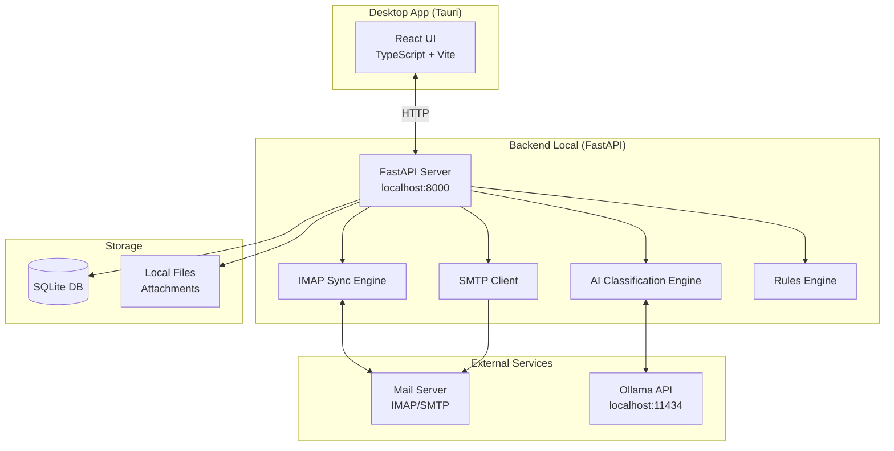
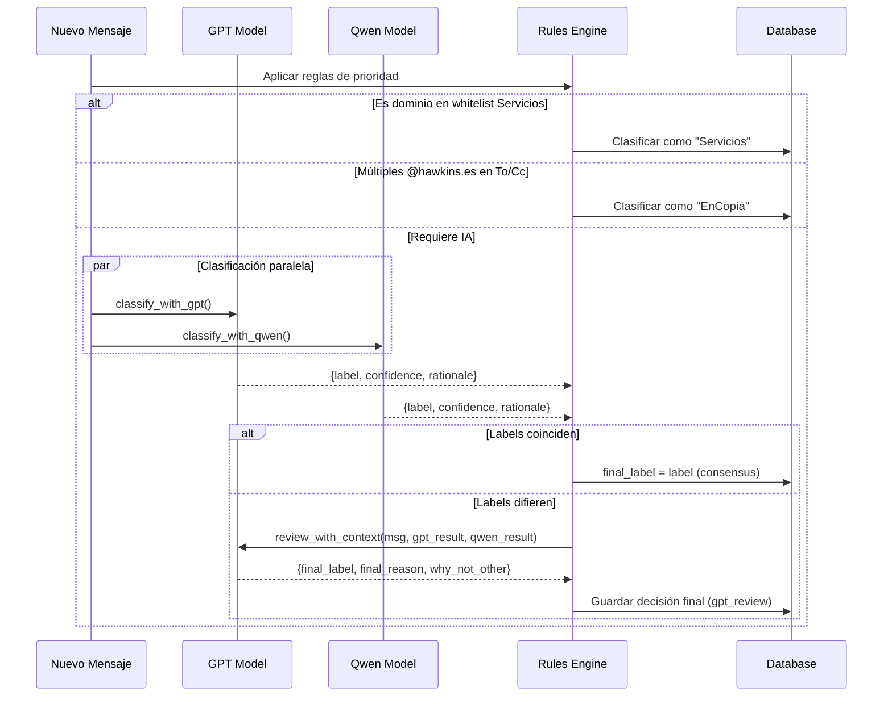

# Mail Manager con IA Local - Diseño Técnico

## 🎯 Resumen Ejecutivo

Aplicación de escritorio para gestión de correo IMAP/SMTP con clasificación automática mediante IA local (Ollama), ejecutándose 100% en local con UI tipo webmail.

**Stack Principal:**
- **Desktop:** Tauri (Rust + WebView)
- **Frontend:** TypeScript + React + Vite
- **Backend:** Python + FastAPI
- **Base de datos:** SQLite + SQLAlchemy
- **IA:** Ollama (modelos: `gpt-oss:120b-cloud`, `qwen3-coder:480b-cloud`)
- **Email:** imaplib + email + aiosmtplib

---

## 🏗️ Arquitectura General



---

## 📊 Modelo de Datos (SQLite)

### Tabla: `accounts`
```sql
CREATE TABLE accounts (
    id INTEGER PRIMARY KEY AUTOINCREMENT,
    email_address TEXT NOT NULL UNIQUE,
    imap_host TEXT NOT NULL,
    imap_port INTEGER NOT NULL,
    smtp_host TEXT NOT NULL,
    smtp_port INTEGER NOT NULL,
    username TEXT NOT NULL,
    encrypted_password TEXT NOT NULL,
    is_active BOOLEAN DEFAULT TRUE,
    created_at TIMESTAMP DEFAULT CURRENT_TIMESTAMP,
    updated_at TIMESTAMP DEFAULT CURRENT_TIMESTAMP
);
```

### Tabla: `messages`
```sql
CREATE TABLE messages (
    id TEXT PRIMARY KEY, -- UUID
    account_id INTEGER NOT NULL,
    imap_uid INTEGER NOT NULL,
    message_id TEXT NOT NULL, -- Email Message-ID header
    thread_id TEXT, -- Para threading
    
    from_name TEXT,
    from_email TEXT NOT NULL,
    to_addresses TEXT, -- JSON array
    cc_addresses TEXT, -- JSON array
    bcc_addresses TEXT, -- JSON array
    
    subject TEXT,
    date TIMESTAMP,
    snippet TEXT, -- Primeras líneas del cuerpo
    
    body_text TEXT,
    body_html TEXT,
    has_attachments BOOLEAN DEFAULT FALSE,
    
    is_read BOOLEAN DEFAULT FALSE,
    is_starred BOOLEAN DEFAULT FALSE,
    
    created_at TIMESTAMP DEFAULT CURRENT_TIMESTAMP,
    
    FOREIGN KEY (account_id) REFERENCES accounts(id) ON DELETE CASCADE,
    UNIQUE(account_id, imap_uid)
);

CREATE INDEX idx_messages_account ON messages(account_id);
CREATE INDEX idx_messages_date ON messages(date DESC);
CREATE INDEX idx_messages_thread ON messages(thread_id);
```

### Tabla: `attachments`
```sql
CREATE TABLE attachments (
    id INTEGER PRIMARY KEY AUTOINCREMENT,
    message_id TEXT NOT NULL,
    filename TEXT NOT NULL,
    mime_type TEXT,
    size_bytes INTEGER,
    local_path TEXT NOT NULL, -- Ruta relativa en storage
    
    FOREIGN KEY (message_id) REFERENCES messages(id) ON DELETE CASCADE
);

CREATE INDEX idx_attachments_message ON attachments(message_id);
```

### Tabla: `classifications`
```sql
CREATE TABLE classifications (
    id INTEGER PRIMARY KEY AUTOINCREMENT,
    message_id TEXT NOT NULL UNIQUE,
    
    -- Primera clasificación (GPT)
    gpt_label TEXT, -- Interesantes|SPAM|EnCopia|Servicios
    gpt_confidence REAL,
    gpt_rationale TEXT,
    
    -- Segunda clasificación (Qwen)
    qwen_label TEXT,
    qwen_confidence REAL,
    qwen_rationale TEXT,
    
    -- Decisión final
    final_label TEXT NOT NULL,
    final_reason TEXT,
    decided_by TEXT NOT NULL, -- 'consensus' | 'gpt_review'
    decided_at TIMESTAMP DEFAULT CURRENT_TIMESTAMP,
    
    FOREIGN KEY (message_id) REFERENCES messages(id) ON DELETE CASCADE
);

CREATE INDEX idx_classifications_label ON classifications(final_label);
```

### Tabla: `service_whitelist`
```sql
CREATE TABLE service_whitelist (
    id INTEGER PRIMARY KEY AUTOINCREMENT,
    domain_pattern TEXT NOT NULL UNIQUE, -- ej: @booking.com, @*.amazon.*
    description TEXT,
    is_active BOOLEAN DEFAULT TRUE,
    created_at TIMESTAMP DEFAULT CURRENT_TIMESTAMP
);
```

### Tabla: `audit_logs`
```sql
CREATE TABLE audit_logs (
    id INTEGER PRIMARY KEY AUTOINCREMENT,
    timestamp TIMESTAMP DEFAULT CURRENT_TIMESTAMP,
    message_id TEXT,
    action TEXT NOT NULL, -- 'sync', 'classify', 'send', 'move', etc.
    payload TEXT, -- JSON con detalles
    status TEXT, -- 'success' | 'error'
    error_message TEXT
);

CREATE INDEX idx_audit_timestamp ON audit_logs(timestamp DESC);
CREATE INDEX idx_audit_message ON audit_logs(message_id);
```

---

## 🔌 API Endpoints (FastAPI)

### Cuentas
- `GET /api/accounts` - Listar cuentas
- `POST /api/accounts` - Crear cuenta
- `PUT /api/accounts/{id}` - Actualizar cuenta
- `DELETE /api/accounts/{id}` - Eliminar cuenta
- `POST /api/accounts/{id}/test` - Probar conexión

### Sincronización
- `POST /api/sync/start` - Iniciar sync manual
- `GET /api/sync/status` - Estado actual del sync
- `GET /api/sync/history` - Historial de syncs

### Mensajes
- `GET /api/messages` - Listar mensajes (con filtros: account, folder, label, search)
- `GET /api/messages/{id}` - Obtener mensaje completo
- `GET /api/messages/{id}/body` - Obtener cuerpo (lazy load)
- `PATCH /api/messages/{id}` - Actualizar flags (read, starred)
- `DELETE /api/messages/{id}` - Eliminar mensaje

### Adjuntos
- `GET /api/attachments/{id}` - Descargar adjunto
- `GET /api/messages/{message_id}/attachments` - Listar adjuntos de un mensaje

### Envío
- `POST /api/send` - Enviar email
  ```json
  {
    "account_id": 1,
    "to": ["dest@example.com"],
    "cc": [],
    "bcc": [],
    "subject": "Asunto",
    "body_text": "Texto plano",
    "body_html": "<p>HTML</p>",
    "attachments": [{"filename": "doc.pdf", "data": "base64..."}]
  }
  ```

### Clasificación
- `POST /api/classify/{message_id}` - Clasificar un mensaje
- `POST /api/classify/batch` - Clasificar múltiples mensajes
- `GET /api/classifications/{message_id}` - Obtener clasificación

### Reglas y Configuración
- `GET /api/whitelist` - Listar whitelist de Servicios
- `POST /api/whitelist` - Añadir dominio a whitelist
- `DELETE /api/whitelist/{id}` - Eliminar de whitelist

### Auditoría
- `GET /api/logs` - Obtener logs (con filtros)
- `GET /api/logs/{message_id}` - Logs de un mensaje específico

---

## 🤖 Motor de Clasificación IA

### Flujo de Clasificación



### Prompts IA

#### Prompt Base (GPT y Qwen)
```python
CLASSIFICATION_PROMPT = """
Eres un asistente de clasificación de correos electrónicos para la empresa Hawkins (@hawkins.es).

**Contexto del correo:**
- De: {from_name} <{from_email}>
- Para: {to_addresses}
- CC: {cc_addresses}
- Asunto: {subject}
- Fecha: {date}
- Cuerpo (primeras 500 palabras): {body_preview}

**Categorías disponibles:**

1. **Interesantes**: Correos con intención real de contratar servicios de Hawkins (presupuestos, propuestas comerciales, reuniones de negocio).

2. **SPAM**: Spam clásico, phishing, newsletters no solicitadas, Y MUY IMPORTANTE: cualquier correo cuyo propósito sea vendernos algo u ofrecernos sus servicios (cold outreach).

3. **EnCopia**: Correos donde hay múltiples destinatarios internos @hawkins.es en To o CC (no dirigidos solo a mí).

4. **Servicios**: Notificaciones transaccionales de plataformas conocidas (booking, bancos, Amazon, etc.).

**IMPORTANTE:**
- Si el correo intenta vendernos algo → SPAM
- Si solicitan nuestros servicios → Interesantes
- Responde SOLO con JSON válido, sin texto adicional.

**Formato de respuesta (JSON estricto):**
{{
  "label": "Interesantes|SPAM|EnCopia|Servicios",
  "confidence": 0.85,
  "rationale": "Máximo 2 frases explicando la decisión"
}}
"""
```

#### Prompt de Revisión (solo GPT, cuando hay desacuerdo)
```python
REVIEW_PROMPT = """
Eres un asistente de clasificación de correos. Dos modelos han clasificado el mismo correo y han llegado a conclusiones diferentes. Debes tomar la decisión final.

**Correo original:**
- De: {from_name} <{from_email}>
- Para: {to_addresses}
- Asunto: {subject}
- Cuerpo: {body_preview}

**Tu clasificación previa:**
- Label: {gpt_label}
- Confianza: {gpt_confidence}
- Razón: {gpt_rationale}

**Clasificación del segundo modelo (Qwen):**
- Label: {qwen_label}
- Confianza: {qwen_confidence}
- Razón: {qwen_rationale}

**Instrucciones:**
Analiza ambas clasificaciones y el correo original. Emite una decisión final única.

**Formato de respuesta (JSON estricto):**
{{
  "final_label": "Interesantes|SPAM|EnCopia|Servicios",
  "final_reason": "Máximo 3 frases explicando tu decisión final",
  "why_not_other": "Máximo 2 frases explicando por qué descartaste la otra clasificación"
}}
"""
```

### Implementación Python (Pseudocódigo)

```python
import httpx
import json

OLLAMA_BASE_URL = "http://localhost:11434"

async def classify_with_model(message: dict, model_name: str) -> dict:
    """Clasifica con un modelo de Ollama."""
    prompt = CLASSIFICATION_PROMPT.format(**message)
    
    async with httpx.AsyncClient(timeout=60.0) as client:
        response = await client.post(
            f"{OLLAMA_BASE_URL}/api/generate",
            json={
                "model": model_name,
                "prompt": prompt,
                "format": "json",  # Forzar salida JSON
                "stream": False
            }
        )
        result = response.json()
        
        # Parsear JSON de la respuesta
        classification = json.loads(result["response"])
        
        return {
            "label": classification["label"],
            "confidence": classification["confidence"],
            "rationale": classification["rationale"]
        }

async def classify_message(message: dict) -> dict:
    """Clasificación completa con consenso."""
    
    # 1. Verificar reglas de prioridad
    if is_service_whitelist(message["from_email"]):
        return {
            "final_label": "Servicios",
            "decided_by": "rule_whitelist",
            "gpt_label": None,
            "qwen_label": None
        }
    
    if is_en_copia(message):
        return {
            "final_label": "EnCopia",
            "decided_by": "rule_multiple_recipients",
            "gpt_label": None,
            "qwen_label": None
        }
    
    # 2. Clasificación con IA
    gpt_result = await classify_with_model(message, "gpt-oss:120b-cloud")
    qwen_result = await classify_with_model(message, "qwen3-coder:480b-cloud")
    
    # 3. Consenso o desempate
    if gpt_result["label"] == qwen_result["label"]:
        return {
            "final_label": gpt_result["label"],
            "decided_by": "consensus",
            "gpt_label": gpt_result["label"],
            "gpt_confidence": gpt_result["confidence"],
            "gpt_rationale": gpt_result["rationale"],
            "qwen_label": qwen_result["label"],
            "qwen_confidence": qwen_result["confidence"],
            "qwen_rationale": qwen_result["rationale"]
        }
    else:
        # Desempate con GPT
        review_result = await review_with_gpt(message, gpt_result, qwen_result)
        return {
            "final_label": review_result["final_label"],
            "final_reason": review_result["final_reason"],
            "decided_by": "gpt_review",
            "gpt_label": gpt_result["label"],
            "qwen_label": qwen_result["label"],
            **gpt_result,
            **qwen_result
        }
```

---

## 🎨 Interfaz de Usuario (React)

### Estructura de Componentes

```
src/
├── components/
│   ├── layout/
│   │   ├── Sidebar.tsx          # Navegación: Inbox, Interesantes, SPAM, etc.
│   │   ├── TopBar.tsx           # Búsqueda, sync status, cuenta activa
│   │   └── MainLayout.tsx
│   ├── mail/
│   │   ├── MessageList.tsx      # Lista de correos (virtualized)
│   │   ├── MessageItem.tsx      # Item individual
│   │   ├── MessageViewer.tsx    # Panel de lectura
│   │   ├── AttachmentList.tsx   # Lista de adjuntos
│   │   └── Composer.tsx         # Redacción de correos
│   ├── settings/
│   │   ├── AccountSettings.tsx  # CRUD de cuentas
│   │   ├── WhitelistSettings.tsx # Configuración whitelist
│   │   └── GeneralSettings.tsx
│   └── common/
│       ├── Button.tsx
│       ├── Input.tsx
│       └── Modal.tsx
├── pages/
│   ├── Inbox.tsx
│   ├── Folder.tsx               # Vista genérica por carpeta/label
│   ├── Settings.tsx
│   └── Logs.tsx
├── hooks/
│   ├── useMessages.ts           # React Query hooks
│   ├── useAccounts.ts
│   └── useClassification.ts
├── services/
│   └── api.ts                   # Cliente HTTP para FastAPI
└── App.tsx
```

### Vistas Principales

1. **Inbox / Carpetas**
   - Lista de mensajes con snippet
   - Indicadores: leído/no leído, estrella, adjuntos, clasificación
   - Panel de lectura lateral o inferior
   - Búsqueda y filtros

2. **Composer**
   - To/Cc/Bcc con autocompletado
   - Editor rich text (opcional: TipTap o Quill)
   - Adjuntar archivos (drag & drop)
   - Botón enviar con confirmación

3. **Settings**
   - Gestión de cuentas (añadir, editar, eliminar, probar conexión)
   - Whitelist de Servicios (tabla editable)
   - Configuración de sync (intervalo, carpetas a sincronizar)

4. **Logs**
   - Tabla de auditoría con filtros
   - Detalles de clasificación por mensaje
   - Métricas: tasa de consenso, distribución de categorías

---

## 🔐 Seguridad

### Cifrado de Credenciales

**Opción 1: Keyring del sistema (recomendado)**
```python
import keyring

# Guardar
keyring.set_password("mail_manager", f"account_{account_id}", password)

# Recuperar
password = keyring.get_password("mail_manager", f"account_{account_id}")
```

**Opción 2: Cifrado con clave derivada**
```python
from cryptography.fernet import Fernet
import base64
import hashlib

# Derivar clave de una master password o UUID de máquina
def get_encryption_key():
    # Usar UUID de máquina + salt
    machine_id = get_machine_uuid()
    key = hashlib.pbkdf2_hmac('sha256', machine_id.encode(), b'salt', 100000)
    return base64.urlsafe_b64encode(key)

cipher = Fernet(get_encryption_key())
encrypted = cipher.encrypt(password.encode())
```

### Sanitización HTML

En el frontend, usar DOMPurify para limpiar HTML de correos:
```typescript
import DOMPurify from 'dompurify';

const sanitizedHTML = DOMPurify.sanitize(message.body_html, {
  ALLOWED_TAGS: ['p', 'br', 'strong', 'em', 'u', 'a', 'img', 'table', 'tr', 'td'],
  ALLOWED_ATTR: ['href', 'src', 'alt', 'style']
});
```

---

## 📦 Estructura del Proyecto

```
mail-manager/
├── frontend/                    # React + TypeScript + Vite
│   ├── src/
│   ├── package.json
│   └── vite.config.ts
├── backend/                     # FastAPI + Python
│   ├── app/
│   │   ├── main.py
│   │   ├── models/              # SQLAlchemy models
│   │   ├── routers/             # API endpoints
│   │   ├── services/            # Business logic
│   │   │   ├── imap_service.py
│   │   │   ├── smtp_service.py
│   │   │   ├── ai_service.py
│   │   │   └── rules_service.py
│   │   └── utils/
│   ├── requirements.txt
│   └── alembic/                 # DB migrations (opcional)
├── src-tauri/                   # Tauri config
│   ├── Cargo.toml
│   ├── tauri.conf.json
│   └── src/
│       └── main.rs
├── shared/                      # Schemas compartidos (TypeScript types)
│   └── types.ts
├── data/                        # SQLite DB + attachments (gitignored)
│   ├── mail.db
│   └── attachments/
├── package.json                 # Root package.json
└── README.md
```

---

## 🚀 Scripts de Desarrollo

### `package.json` (root)
```json
{
  "scripts": {
    "dev": "concurrently \"npm run dev:backend\" \"npm run dev:frontend\" \"npm run tauri dev\"",
    "dev:backend": "cd backend && uvicorn app.main:app --reload --port 8000",
    "dev:frontend": "cd frontend && npm run dev",
    "build": "npm run build:frontend && npm run tauri build",
    "build:frontend": "cd frontend && npm run build"
  }
}
```

### Configuración Tauri

**`src-tauri/tauri.conf.json`**
```json
{
  "build": {
    "beforeDevCommand": "npm run dev:frontend",
    "beforeBuildCommand": "npm run build:frontend",
    "devPath": "http://localhost:5173",
    "distDir": "../frontend/dist"
  },
  "tauri": {
    "bundle": {
      "identifier": "com.hawkins.mailmanager",
      "targets": ["msi", "nsis"]
    },
    "allowlist": {
      "all": false,
      "shell": {
        "sidecar": true,
        "scope": [
          {
            "name": "backend",
            "sidecar": true,
            "args": true
          }
        ]
      }
    }
  }
}
```

---

## 🧪 Testing

### Backend (pytest)
```python
# tests/test_classification.py
async def test_consensus_classification():
    message = {...}
    result = await classify_message(message)
    assert result["decided_by"] == "consensus"
    assert result["final_label"] in ["Interesantes", "SPAM", "EnCopia", "Servicios"]

async def test_whitelist_priority():
    message = {"from_email": "noreply@booking.com", ...}
    result = await classify_message(message)
    assert result["final_label"] == "Servicios"
```

### Frontend (Vitest + React Testing Library)
```typescript
// tests/MessageList.test.tsx
test('renders message list', async () => {
  render(<MessageList />);
  await waitFor(() => {
    expect(screen.getByText(/Inbox/i)).toBeInTheDocument();
  });
});
```

---

## 📋 Checklist de Aceptación

- [ ] Conexión a cuenta IMAP/SMTP funcional
- [ ] Sync incremental de correos (solo nuevos)
- [ ] Lectura de correos con HTML sanitizado
- [ ] Descarga de adjuntos
- [ ] Envío de correos con adjuntos
- [ ] Clasificación automática con GPT + Qwen
- [ ] Consenso: si coinciden → aplicar directamente
- [ ] Desempate: si difieren → GPT revisa y decide
- [ ] Regla EnCopia: detecta múltiples @hawkins.es
- [ ] Regla Servicios: whitelist configurable
- [ ] Prioridad: Servicios > EnCopia > Interesantes/SPAM
- [ ] UI: vistas por categoría funcionales
- [ ] Búsqueda de correos
- [ ] Logs de auditoría por mensaje
- [ ] Credenciales cifradas
- [ ] Binario instalable Windows

---

## 🔄 Próximos Pasos

1. **Scaffolding inicial** (Etapa 0)
2. **Motor IMAP básico** (Etapa 1)
3. **Lectura + adjuntos** (Etapa 2)
4. **Envío SMTP** (Etapa 3)
5. **IA + consenso** (Etapa 4)
6. **Clasificación automática** (Etapa 5)
7. **Observabilidad** (Etapa 6)

---

**Documento vivo**: Este diseño se actualizará conforme avance la implementación.
